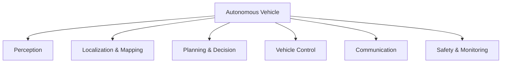

## System

The {{entity:Autonomous Vehicle}} ({{hex:D7F7725D}}) system decomposition is now fully scaffolded and has entered initial requirements generation. The project `se-autonomous-vehicle` was partially created in a prior session (documents and trace linksets existed) but had no sections, entities, requirements, or diagrams. This session completed the scaffolding and wrote the first 28 requirements across all six document types, with 22 trace links binding them into a coherent derivation chain from stakeholder needs through to verification.

## Decomposition

The system was decomposed into six subsystems, each classified in the `SE:autonomous-vehicle` namespace:

- {{entity:Perception Subsystem}} ({{hex:55F73209}}) — LiDAR, camera, radar sensor fusion
- {{entity:Localization and Mapping Subsystem}} ({{hex:51F73019}}) — GPS, IMU, HD map matching
- {{entity:Planning and Decision Subsystem}} ({{hex:51B73B19}}) — route, behaviour, and motion planning
- {{entity:Vehicle Control Subsystem}} ({{hex:51F73A19}}) — steering, throttle, braking actuators
- {{entity:Communication Subsystem}} ({{hex:51F57319}}) — V2X, cellular, OTA updates
- {{entity:Safety and Monitoring Subsystem}} ({{hex:51B77A59}}) — fault detection, emergency fallback, ISO 26262

The context diagram identifies five external actors: Passengers, Road Infrastructure, Other Road Users, Fleet Management, and Regulatory Authority. Data flows include traffic signals and road geometry inbound from infrastructure, telemetry and diagnostics outbound to fleet management, and compliance constraints from regulators.

## Analysis

The {{entity:Perception Subsystem}} at {{hex:55F73209}} shows strong trait alignment with the {{entity:fire control system}} ({{hex:55F7725D}}, Jaccard 0.875, 28 shared traits). Both are {{trait:Active}}, {{trait:Observable}}, signal-processing systems that must detect, classify, and respond to environmental stimuli under time pressure. The fire control system's emphasis on target discrimination under clutter mirrors the autonomous vehicle perception challenge of classifying objects in visually complex urban scenes. This analog suggests that the perception subsystem's requirements should explicitly address false positive rates and discrimination confidence — requirements common in fire control but sometimes underspecified in AV perception.

The {{entity:Inertial Navigation System (INS)}} appears at Jaccard 0.844, confirming the localization subsystem's architectural kinship with established navigation systems and validating the choice to separate localization from perception.

Lint classified 12 domain concepts from the 28 requirements. The automated classification confirmed that entities like {{entity:ISO 26262}} and {{entity:HD map reference frame}} are correctly typed as institutional and structural references rather than physical components.

## Requirements

Six stakeholder requirements ({{stk:STK-STAKEHOLDERNEEDS-001}} through {{stk:STK-STAKEHOLDERNEEDS-006}}) cover safety, availability, regulatory compliance, passenger comfort, fleet operability, and environmental resilience. Ten system requirements ({{sys:SYS-SYSTEM-LEVELREQUIREMENTS-001}} through {{sys:SYS-SYSTEM-LEVELREQUIREMENTS-010}}) derive from these, specifying detection ranges, localization accuracy, emergency stop timing, trajectory smoothness, V2X standards, OTA update procedures, weather degradation limits, end-to-end latency, MTBCF, and ISO 26262 ASIL D compliance.

The Perception Subsystem received six subsystem requirements ({{sub:SUB-SUBSYSTEMREQUIREMENTS-001}} through {{sub:SUB-SUBSYSTEMREQUIREMENTS-006}}) covering LiDAR processing, object classification taxonomy, sensor fusion latency, degraded-weather fusion adaptation, sensor self-diagnostics, and multi-object tracking continuity. Three interface requirements define the Perception-to-Planning, Planning-to-Control, and Perception-to-Safety data exchanges with specified rates and latencies. Three verification entries define test approaches for LiDAR processing, fusion latency, and interface throughput.

All 22 trace links follow the derivation chain: STK → SYS → SUB/IFC → VER.

## Next

Five subsystems remain without subsystem-level requirements: Localization and Mapping, Planning and Decision, Vehicle Control, Communication, and Safety and Monitoring. The next session should decompose the Localization and Mapping Subsystem into components (GPS receiver, IMU, wheel odometry encoder, HD map server, SLAM processor), generate its subsystem requirements, and define the Localization-to-Planning interface. The fire control system analog warrants adding explicit false-positive-rate requirements to Perception in a follow-up pass.
