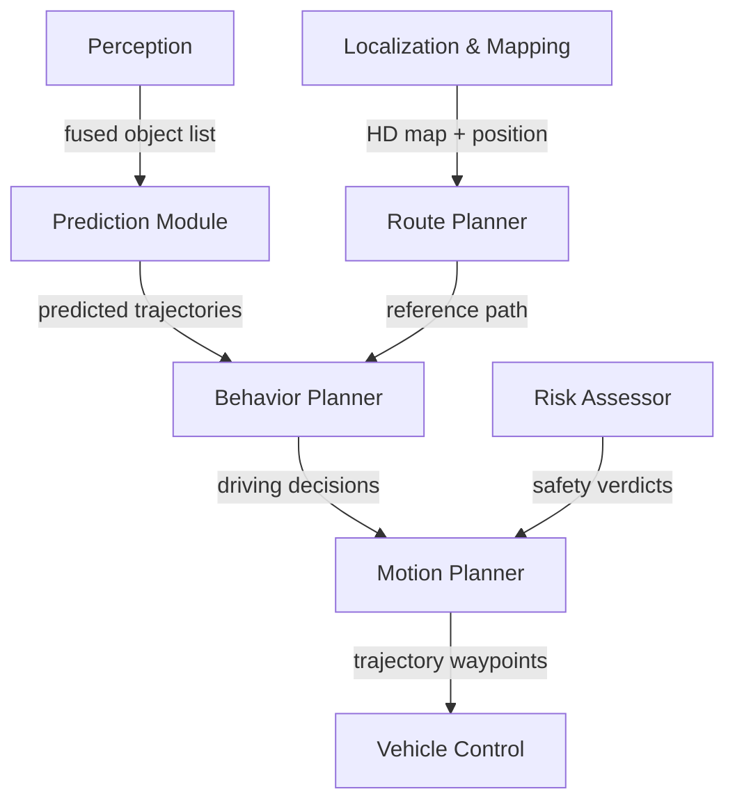

## System

The {{entity:Autonomous Vehicle}} decomposition continues in its second session. Six subsystems were identified and classified in session 161: {{entity:Perception Subsystem}}, {{entity:Planning and Decision Subsystem}}, {{entity:Vehicle Control Subsystem}}, {{entity:Safety and Monitoring Subsystem}}, {{entity:Communication Subsystem}}, and {{entity:Localization and Mapping Subsystem}}. The Perception Subsystem received its subsystem requirements (SUB-001 through SUB-006) in the prior session. This session deepens the decomposition by breaking the {{entity:Planning and Decision Subsystem}} into its internal components and generating requirements, interfaces, and verification entries for them. The project now contains 41 requirements across all six documents with 35 trace links.

## Decomposition

The {{entity:Planning and Decision Subsystem}} was decomposed into five components:

- **{{entity:Behavior Planner}}** ({{hex:41F77B19}}) — tactical decision-making: lane changes, intersection negotiation, yielding. Consumes predicted trajectories and the reference path, produces discrete driving actions.
- **{{entity:Motion Planner}}** ({{hex:41F73B19}}) — trajectory generation: converts behaviour decisions into smooth, kinematically feasible waypoint sequences. Accepts safety verdicts from the Risk Assessor before committing.
- **{{entity:Prediction Module}}** ({{hex:51F77319}}) — forecasts future trajectories and intent of surrounding road users over a 5-second horizon using learned motion models and HD map context.
- **{{entity:Route Planner}}** ({{hex:41B73B09}}) — global path planning from origin to destination on the HD map graph, providing the reference path the Behavior Planner follows tactically.
- **{{entity:Risk Assessor}}** ({{hex:41B73B09}}) — continuous safety gate evaluating candidate trajectories for time-to-collision, required deceleration, and safety envelope violations. Vetoes unsafe plans and triggers MRC handoff.

The data flow reveals the Behavior Planner as the convergence point — it receives both predicted trajectories from the Prediction Module and the global reference path from the Route Planner before issuing driving decisions downstream to the Motion Planner. The Risk Assessor acts as a parallel safety gate on the Motion Planner's output rather than being in-line with the decision chain.

## Analysis

The {{entity:Route Planner}} and {{entity:Risk Assessor}} received identical hex codes ({{hex:41B73B09}}), sharing all 32 trait classifications. Both are abstract, synthetic, algorithmic, rule-governed, compositional, and system-essential. Despite performing very different functions — global path optimisation versus real-time safety evaluation — they occupy the same ontological niche as decision-gating algorithmic components. This suggests their architectural distinction is purely functional rather than structural, and integration testing should treat them as interchangeable in terms of computational platform requirements.

Cross-domain similarity search for the {{entity:Risk Assessor}} found a strong match with {{entity:closed-loop control system}} at 87.5% Jaccard (28 shared traits). This reinforces the architecture: the Risk Assessor functions as a feedback controller within the planning loop, continuously evaluating trajectory outputs and correcting (vetoing) unsafe plans. This control-theoretic framing suggests that formal stability analysis methods from control engineering could apply to verifying the Risk Assessor's convergence properties.

Lint identified two medium findings: VER-001 lacks statistical parameters for LiDAR coverage verification, and verification requirements are co-mingled with functional requirements. The structural issue is by design — verification entries live in a dedicated VER document — but the orphan report flags all 41 requirements, likely a display artefact since the linkset query confirms 35 active trace links.

## Requirements

Seven subsystem requirements were generated for the Planning and Decision Subsystem ({{sub:SUB-SUBSYSTEMREQUIREMENTS-007}} through {{sub:SUB-SUBSYSTEMREQUIREMENTS-013}}), covering the Behavior Planner's 20ms decision cycle, Motion Planner's 50-waypoint trajectory generation with jerk limits, Prediction Module's 5-second forecast horizon and intent classification, Risk Assessor's MRC handoff trigger, and Route Planner's 500ms replanning capability. All trace to parent system requirements — {{sys:SYS-SYSTEM-LEVELREQUIREMENTS-008}} (100ms sense-plan-act cycle) drives the majority, with {{sys:SYS-SYSTEM-LEVELREQUIREMENTS-001}}, {{sys:SYS-SYSTEM-LEVELREQUIREMENTS-003}}, and {{sys:SYS-SYSTEM-LEVELREQUIREMENTS-004}} each deriving one or two subsystem requirements.

Three new interface requirements ({{ifc:IFC-INTERFACEDEFINITIONS-004}} through {{ifc:IFC-INTERFACEDEFINITIONS-006}}) define the internal data contracts: Prediction-to-Behavior at 10 Hz with intent labels, Behavior-to-Motion with action commands under 5ms latency, and Risk-to-Motion with pass/fail verdicts evaluated within 5ms of trajectory submission.

Three verification entries (VER-004 through VER-006) specify how the Behavior Planner's decision cycle, Risk Assessor's MRC handoff, and Prediction Module's forecast accuracy will be verified against their parent requirements.

## Next

Four subsystems remain without subsystem-level requirements: {{entity:Vehicle Control Subsystem}}, {{entity:Safety and Monitoring Subsystem}}, {{entity:Communication Subsystem}}, and {{entity:Localization and Mapping Subsystem}}. The next session should decompose the {{entity:Vehicle Control Subsystem}} — it directly consumes the Motion Planner's trajectory output and is the most tightly coupled downstream subsystem. The empty context and decomposition diagrams (created in session 161 with zero blocks) should also be populated. The VER-001 statistical parameter gap flagged by lint should be addressed when the Perception Subsystem is revisited.
