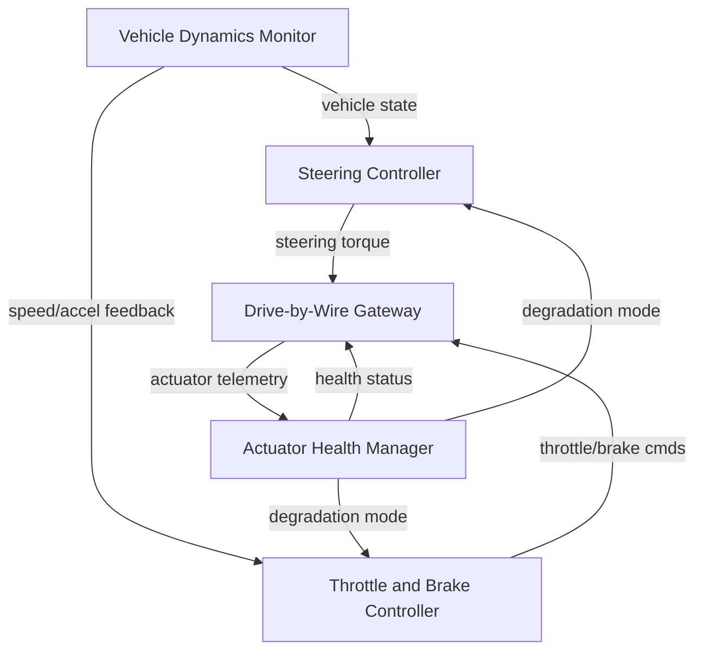

## System

The {{entity:Autonomous Vehicle}} decomposition continues with three subsystems now component-decomposed: Perception (requirements only, session 161), Planning and Decision (5 components + 7 requirements, session 162), and now Vehicle Control (5 components + 7 requirements + 3 interface requirements, this session). Three subsystems remain untouched: {{entity:Localization and Mapping Subsystem}}, {{entity:Communication Subsystem}}, and {{entity:Safety and Monitoring Subsystem}}. The project holds 54 requirements across all six documents with 48 trace links and baseline BL-003.

## Decomposition

The {{entity:Vehicle Control Subsystem}} was decomposed into five components that together close the loop between motion planning commands and physical vehicle actuation.

The {{entity:Steering Controller}} ({{hex:D5F77819}}) converts lateral path-following commands into steering torque signals. The {{entity:Throttle and Brake Controller}} ({{hex:D5F73A19}}) manages longitudinal acceleration and deceleration with jerk limiting. Both controllers feed into the {{entity:Drive-by-Wire Gateway}} ({{hex:51F57819}}), which translates software commands into CAN bus messages for the physical actuators. The {{entity:Vehicle Dynamics Monitor}} ({{hex:55F53318}}) fuses IMU, wheel speed, and steering angle data to provide closed-loop state feedback to both controllers. The {{entity:Actuator Health Manager}} ({{hex:45B77A19}}) monitors actuator telemetry from the gateway, detects faults, and commands degradation modes back to the controllers.

The architecture separates control law computation (SC, TBC) from physical bus access (DBW) and health management (AHM), creating clean safety boundaries. The Vehicle Dynamics Monitor sits upstream of both controllers, providing the state estimates needed for closed-loop tracking.

## Analysis

The lint report flagged the {{entity:Steering Controller}} and {{entity:Throttle and Brake Controller}} as {{trait:Physical Object}} entities — both classified with 19 traits and sharing 78% Jaccard similarity with the top-level {{entity:Autonomous Vehicle}}. This is ontologically correct: both are electronic control units with physical embodiment, unlike purely software components such as the {{entity:Behavior Planner}} or {{entity:Prediction Module}}.

The most interesting cross-domain analog came from the {{entity:Drive-by-Wire Gateway}}: a 87.5% Jaccard match with Point-to-point protocol ({{hex:40F57918}}) and 84.4% with network firewall ({{hex:50B77119}}). The protocol analog confirms the gateway's core nature as a signal mediator and translator. The firewall analog highlights its role as a trust boundary — all safety-critical commands pass through it, making message authentication and watchdog supervision essential. This insight directly supports {{ifc:IFC-INTERFACEDEFINITIONS-008}}'s requirement for CAN FD message authentication codes.

The lint structural finding about verification requirements being co-mingled with functional requirements is a known consequence of having all VER entries in a single document with no separate lint category. The trace links from subsystem and interface requirements to verification entries are correctly established.

## Requirements

Seven subsystem requirements were created for Vehicle Control components. {{sub:SUB-VEHICLECONTROLSUBSYSTEM-014}} specifies steering angle tracking accuracy (0.5° steady-state, 150 ms settling). {{sub:SUB-VEHICLECONTROLSUBSYSTEM-015}} constrains longitudinal jerk to 1.5 m/s³ with 100 ms deceleration response. {{sub:SUB-VEHICLECONTROLSUBSYSTEM-016}} bounds the gateway's command translation latency to 5 ms with delivery acknowledgement. {{sub:SUB-VEHICLECONTROLSUBSYSTEM-017}} sets vehicle state estimation accuracy at 100 Hz. {{sub:SUB-VEHICLECONTROLSUBSYSTEM-018}} requires fault classification and degradation mode initiation within 50 ms. {{sub:SUB-VEHICLECONTROLSUBSYSTEM-019}} mandates a 50 ms hardware watchdog with safe-state fallback. {{sub:SUB-VEHICLECONTROLSUBSYSTEM-020}} enforces steering rate limiting during degradation.

Three interface requirements define the internal data flows: {{ifc:IFC-INTERFACEDEFINITIONS-007}} (dynamics-to-steering at 100 Hz, 2 ms latency), {{ifc:IFC-INTERFACEDEFINITIONS-008}} (dual-redundant CAN FD with MAC authentication), and {{ifc:IFC-INTERFACEDEFINITIONS-009}} (gateway-to-health-manager telemetry at 50 Hz). All subsystem and interface requirements trace to parent system requirements ({{sys:SYS-SYSTEM-LEVELREQUIREMENTS-003}}, {{sys:SYS-SYSTEM-LEVELREQUIREMENTS-004}}, {{sys:SYS-SYSTEM-LEVELREQUIREMENTS-008}}, {{sys:SYS-SYSTEM-LEVELREQUIREMENTS-009}}, {{sys:SYS-SYSTEM-LEVELREQUIREMENTS-010}}). Three verification entries cover steering HIL testing, watchdog fault injection, and CAN bus conformance.

## Next

Four subsystems remain without component decomposition. The next session should tackle the {{entity:Safety and Monitoring Subsystem}}, which interfaces with every other subsystem and is central to the vehicle's minimal risk condition strategy. After that, {{entity:Localization and Mapping Subsystem}} and {{entity:Communication Subsystem}} are needed to complete the full decomposition. The {{entity:Perception Subsystem}} has requirements but no component-level breakdown in the entity graph — that gap should also be closed.
