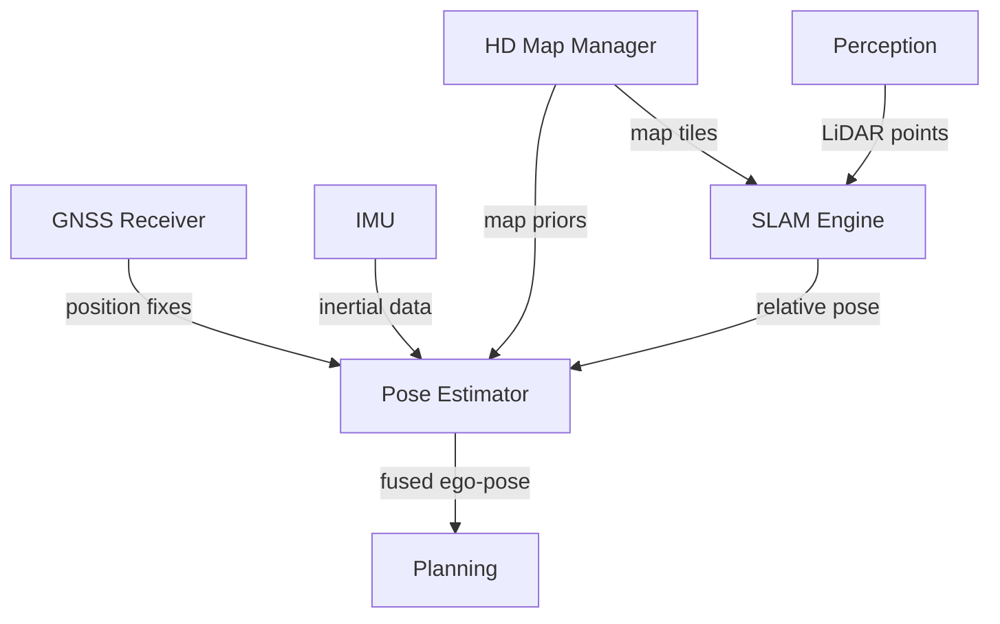

## System

The {{entity:Autonomous Vehicle}} decomposition continues into its fourth session. Three of six subsystems now have full component-level decomposition: {{entity:Perception Subsystem}} (requirements only, session 161), {{entity:Planning and Decision Subsystem}} (session 162), and {{entity:Vehicle Control Subsystem}} (session 163). This session decomposes the {{entity:Localization and Mapping Subsystem}}, leaving {{entity:Safety and Monitoring Subsystem}} and {{entity:Communication Subsystem}} for future sessions. The project now holds 64 requirements across all documents, 61 trace links, and 6 diagrams.

## Decomposition

The {{entity:Localization and Mapping Subsystem}} was broken into five components reflecting the canonical sensor fusion architecture for autonomous positioning:

- **{{entity:GNSS Receiver}}** ({{hex:D5F77019}}) — multi-constellation satellite receiver with RTK correction for absolute geodetic fixes
- **{{entity:Inertial Measurement Unit}}** ({{hex:D4F51018}}) — six-axis accelerometer/gyroscope package for high-rate dead reckoning between GNSS updates
- **{{entity:SLAM Engine}}** ({{hex:41F73309}}) — processes LiDAR point clouds against stored map features for relative localisation
- **{{entity:HD Map Manager}}** ({{hex:40A53109}}) — indexes and serves lane-level map tiles with semantic features for map-matching priors
- **{{entity:Pose Estimator}}** ({{hex:41F73309}}) — central fusion node combining all four sources via Extended Kalman Filter to produce 6-DOF ego-pose at 100 Hz

The data flow architecture converges on the {{entity:Pose Estimator}} as the single authoritative source of vehicle state. Three independent localization channels (GNSS, IMU dead reckoning, SLAM map-matching) feed into it, with the {{entity:HD Map Manager}} providing priors to both the {{entity:SLAM Engine}} and the {{entity:Pose Estimator}} directly.

## Analysis

The classification of {{entity:Pose Estimator}} and {{entity:SLAM Engine}} produced identical hex codes ({{hex:41F73309}}): both are non-physical, {{trait:Synthetic}}, {{trait:Active}}, signal-processing, state-transforming, system-integrated, functionally autonomous, compositional software components. This convergence is architecturally sound — both are algorithmic fusion engines that share the same ontological nature despite operating at different levels of abstraction. The {{entity:GNSS Receiver}} ({{hex:D5F77019}}) and {{entity:IMU}} ({{hex:D4F51018}}) differ primarily in the {{trait:Active}}, {{trait:Signalling}}, and {{trait:Rule-governed}} traits, reflecting that the GNSS receiver actively processes satellite signals using protocol-governed logic, while the IMU is a passive sensor that measures physical quantities without protocol interpretation.

Cross-domain similarity search showed {{entity:Pose Estimator}} sharing 93.75% trait overlap with {{entity:Motion Planner}} and {{entity:Route Planner}} — expected for algorithmic components within the same system. The nearest out-of-domain analog was "genetic algorithm" at 90.6%, confirming the Pose Estimator's classification as a purely computational, state-transforming process.

Lint flagged {{sub:SUB-SUBSYSTEMREQUIREMENTS-027}} for lacking degraded-mode performance criteria, though the requirement does specify 30 cm lateral accuracy. The structural finding about verification requirements mixed with functional requirements persists from prior sessions.

## Requirements

Seven subsystem requirements ({{sub:SUB-SUBSYSTEMREQUIREMENTS-021}} through {{sub:SUB-SUBSYSTEMREQUIREMENTS-027}}) were generated, all traced to parent system requirements. The most engineering-significant are:

- {{sub:SUB-SUBSYSTEMREQUIREMENTS-023}}: IMU dead reckoning accuracy of 0.1% distance travelled for 30 seconds during GNSS outage — this sets the bridge performance for tunnel and urban canyon scenarios
- {{sub:SUB-SUBSYSTEMREQUIREMENTS-026}}: GNSS multipath rejection using cross-source consistency checks — critical for urban environments where reflected signals are common, traced to both {{sys:SYS-SYSTEM-LEVELREQUIREMENTS-002}} and {{sys:SYS-SYSTEM-LEVELREQUIREMENTS-010}} (ASIL D)
- {{sub:SUB-SUBSYSTEMREQUIREMENTS-027}}: graceful degradation maintaining 30 cm lateral accuracy with any single source unavailable, traced to {{sys:SYS-SYSTEM-LEVELREQUIREMENTS-003}} (fault response)

Three interface requirements ({{ifc:IFC-INTERFACEDEFINITIONS-010}} through {{ifc:IFC-INTERFACEDEFINITIONS-012}}) define the GNSS-to-Pose, IMU-to-Pose, and Pose-to-Planning data flows with rate and format specifications. All 10 new requirements have trace links to parent system requirements; 11 total trace links were created this session.

## Next

Two subsystems remain undecomposed: {{entity:Safety and Monitoring Subsystem}} and {{entity:Communication Subsystem}}. The next session should tackle {{entity:Safety and Monitoring Subsystem}} as it cross-cuts all other subsystems and drives ASIL D compliance. Its decomposition will likely include fault detection, system health monitoring, minimal risk condition management, and event data recording — components that interface with every other subsystem already decomposed. The orphan report indicates prior-session requirements lack trace links, which should be addressed as structural debt.
