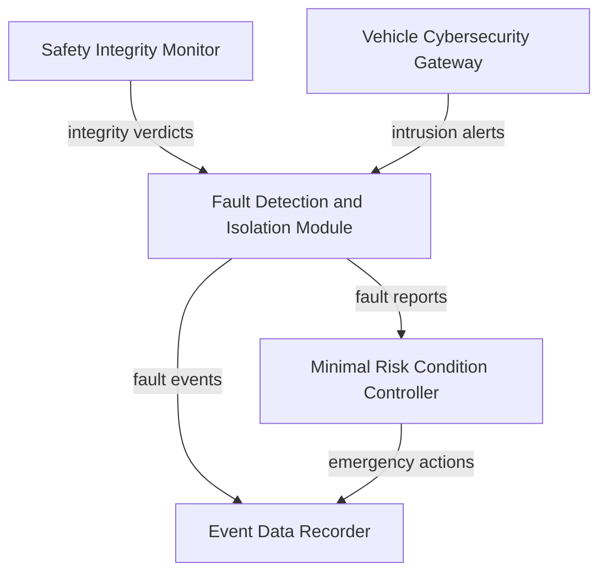

## System

The {{entity:Autonomous Vehicle}} decomposition continues into its fifth subsystem session. Four of five top-level subsystems — Perception, Planning and Decision, Vehicle Control, and Localization and Mapping — have been decomposed into components with requirements and verification entries. This session tackles the {{entity:Safety and Monitoring Subsystem}}, the last subsystem without internal structure. The project now holds 81 requirements across 6 documents with 78 trace links, baselined as DECOMP-2026-03-14.

## Decomposition

The {{entity:Safety and Monitoring Subsystem}} was decomposed into five components, each classified in UHT and stored in the `SE:autonomous-vehicle` namespace:

- **{{entity:Fault Detection and Isolation Module}}** ({{hex:41B77B19}}) — monitors health telemetry from all subsystems, performs anomaly detection, and isolates faulty components to prevent cascading failures.
- **{{entity:Minimal Risk Condition Controller}}** ({{hex:51F77A59}}) — executes graduated emergency manoeuvres (reduced speed, controlled pullover, emergency stop) when faults are confirmed.
- **{{entity:Safety Integrity Monitor}}** ({{hex:51B73859}}) — independent watchdog verifying execution timing and control flow integrity of ASIL D functions at 100 Hz.
- **{{entity:Event Data Recorder}}** ({{hex:D0A53259}}) — crash-survivable black box recording sensor inputs, decisions, and actuator commands with a 30-second pre-incident buffer.
- **{{entity:Vehicle Cybersecurity Gateway}}** ({{hex:51B77859}}) — monitors in-vehicle networks for intrusion, validates message authenticity via AUTOSAR SecOC, and enforces domain segmentation per ISO/SAE 21434.

The internal data flow centres on the FDI Module as a hub: the Safety Integrity Monitor feeds integrity verdicts into FDI, the Cybersecurity Gateway routes intrusion alerts to FDI, FDI dispatches fault reports to the MRC Controller, and both FDI and MRC log events to the Event Data Recorder.

## Analysis

The lint report surfaced 10 findings. The most actionable is a medium-severity gap in {{sub:SUB-SUBSYSTEMREQUIREMENTS-027}} (Localization), which specifies a degraded mode but lacks quantitative performance criteria — a gap worth addressing in a future session. The ontological ambiguity findings (physical vs. abstract classification differences between the vehicle and its software components) are expected and benign: a controller is not a physical object even when it shares many functional traits with the system it controls.

The cross-domain entity search found that {{entity:Safety Integrity Monitor}} shares 84% Jaccard similarity with an {{entity:Automated Fire Detection and Suppression System}} from the entity graph. Both are independent monitoring components that detect hazardous conditions and trigger automated protective responses without human intervention. This parallel validates the architectural choice of making the SIM fully independent from the components it monitors — fire suppression systems similarly operate on dedicated circuits isolated from the systems they protect.

The {{entity:Minimal Risk Condition Controller}} at {{hex:51F77A59}} shares 78% Jaccard with the {{entity:Autonomous Vehicle}} system entity itself — the highest intra-system similarity observed. This reflects the MRC's unique position as the component that must replicate a subset of the vehicle's full driving capability (steering, braking, signalling) under fault conditions.

## Requirements

Eight subsystem requirements were created ({{sub:SUB-SUBSYSTEMREQUIREMENTS-028}} through {{sub:SUB-SUBSYSTEMREQUIREMENTS-035}}), covering fault detection latency (50 ms), MRC initiation timing (100 ms), SIM watchdog rate (100 Hz), EDR data rate (100 Mbps with UN R157 survivability), cybersecurity intrusion detection (10 ms), multi-fault classification (3 concurrent faults), graduated MRC response levels (3 tiers), and EDR pre-incident buffering (30 seconds).

Four interface requirements ({{ifc:IFC-INTERFACEDEFINITIONS-013}} through {{ifc:IFC-INTERFACEDEFINITIONS-016}}) define the fault report, integrity verdict, event logging, and intrusion alert interfaces with specific data content and timing constraints.

All subsystem requirements trace to parent system requirements: {{sys:SYS-SYSTEM-LEVELREQUIREMENTS-003}} (MRC mandate), {{sys:SYS-SYSTEM-LEVELREQUIREMENTS-009}} (MTBCF), and {{sys:SYS-SYSTEM-LEVELREQUIREMENTS-010}} (ASIL D). Five verification entries ({{sub:VER-VERIFICATIONMETHODS-010}} through {{sub:VER-VERIFICATIONMETHODS-014}}) define HIL fault injection, closed-course MRC testing, SIM timing analysis, EDR crash simulation, and cybersecurity penetration testing.

## Next

One subsystem remains: the {{entity:Communication Subsystem}}. The next session should decompose it into components (V2X radio, telemetry uplink, OTA update manager, fleet management interface), generate subsystem and interface requirements, and create verification entries. Once Communication is complete, all five subsystems will be fully decomposed and the system can be marked complete. The degraded-mode performance gap in {{sub:SUB-SUBSYSTEMREQUIREMENTS-027}} should also be addressed.
